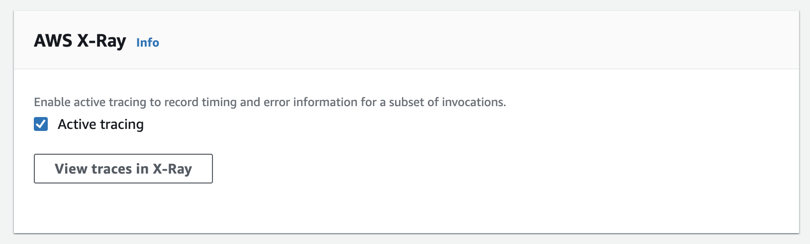
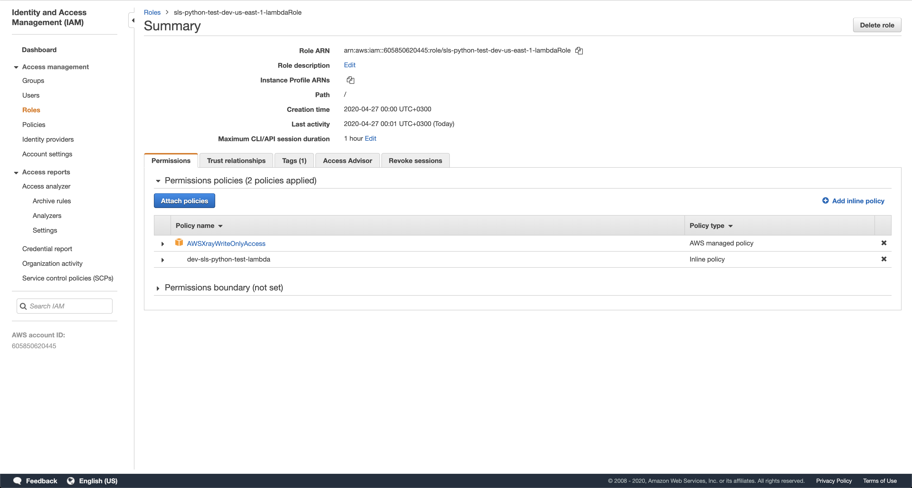
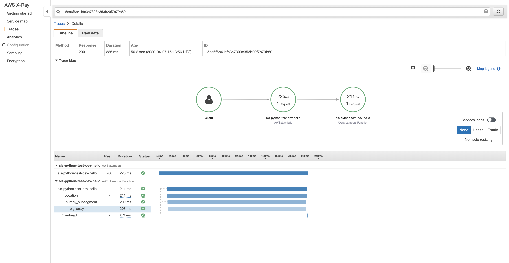
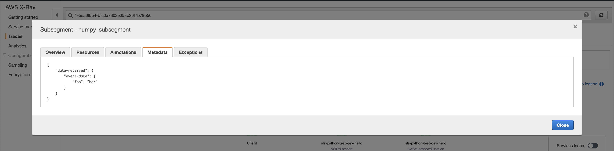
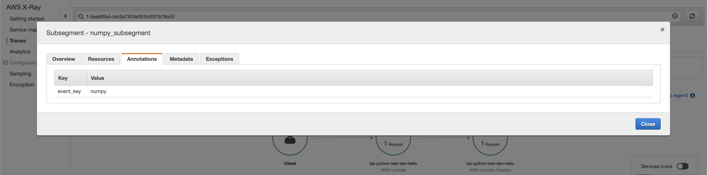

# Serverless Python Dependencies Test

This project was created using the serverless framework using AWS Lambda functions as backend adapted from [this guide](https://serverless.com/blog/serverless-python-packaging/). To begin run:
```bash
npm install -g serverless
serverless create \
  --template aws-python3 \
  --name sls-python-test \
  --path sls-python-test
cd sls-python-test/
```

In this example, a python virtual-environment is created as `venv/` on the root folder and is ignored from version control. it also requires the use of the libraries `pyenv`, `pipenv` and `virtualenv`, so that the project can run without depending on computer-specific resources.
```bash
pyenv local # sets the python version to 3.8.X. Install both pyenv and the version if necessary
virtualenv venv -p python # uses the previously set python to create the env
source venv/bin/activate # to activate the local venv. Run it every time you cd into this function
python -V # make sure you are running 3.8.X
deactivate # to deactivate later, or just close the terminal window
pipenv --venv # to check the path to the running venv
```

Install your dependencies using `pipenv`:
```bash
pipenv install # to install what's on the Pipfile.lock
pipenv install 'numpy==1.16' # if you want to add any new lib with a specific version to your Pipfile
pipenv lock -r # to check the list of requirements that will be installed in the Lambda function
```

Install the wrapper to allow `requirements.txt` to be used in the Lambda function:
```bash
sls plugin install -n serverless-python-requirements
```

Notice that these lines have been added to the `serverless.yml` file so that it uses `docker` to generate the requirements, making it even more standard and reducing potential config failures:
```yaml
custom:
  pythonRequirements:
    dockerizePip: true
```

With the dependencies installed and your [AWS profile activated](https://serverless.com/framework/docs/providers/aws/guide/quick-start/) you can deploy your function:
```bash
sls deploy # creates or updates the stack
# sample output:
Serverless: Generating requirements.txt from Pipfile...
Serverless: Parsed requirements.txt from Pipfile in ./.serverless/requirements.txt...
Serverless: Using static cache of requirements found at /Users/yourusername/Library/Caches/serverless-python-requirements/d7bbf49e6701fce9a812a827555a05c57c02c06f0145a97a7f5f54b214db67fc_slspyc ...
Serverless: Packaging service...
Serverless: Excluding development dependencies...
Serverless: Injecting required Python packages to package...
Serverless: Uploading CloudFormation file to S3...
Serverless: Uploading artifacts...
Serverless: Uploading service sls-python-test.zip file to S3 (37.41 MB)...
Serverless: Validating template...
Serverless: Updating Stack...
Serverless: Checking Stack update progress...
.........
Serverless: Stack update finished...
Service Information
service: sls-python-test
stage: dev
region: us-east-1
stack: sls-python-test-dev
resources: 6
api keys:
  None
endpoints:
  None
functions:
  hello: sls-python-test-dev-hello
layers:
  None
Serverless: Removing old service artifacts from S3...
Serverless: Run the "serverless" command to setup monitoring, troubleshooting and testing.
```

To test your deployed function run this command and you should get a response like this:
```bash
sls invoke -f hello --log -d '{"foo": "bar"}' # to invoke the function and passing some JSON data
# sample output:
{
    "statusCode": 200,
    "body": "{\"message\": \"Go Serverless v1.0! Your function executed successfully!\", \"input\": {\"foo\": \"bar\"}}"
}
--------------------------------------------------------------------
START RequestId: 8766db24-c5c9-44b1-8da3-751a192a23a7 Version: $LATEST
Your numpy array:
[[ 0  1  2  3  4]
 [ 5  6  7  8  9]
 [10 11 12 13 14]]
END RequestId: 8766db24-c5c9-44b1-8da3-751a192a23a7
REPORT RequestId: 8766db24-c5c9-44b1-8da3-751a192a23a7	Duration: 1.24 ms	Billed Duration: 100 ms	Memory Size: 1024 MB	Max Memory Used: 80 MB	Init Duration: 320.25 ms
```

To enable AWS X-Ray in your function, activate it on the Lambda function detail page on your AWS Console and if necessary add `AWSXRayWriteOnlyAccess` to the execution role.



The you can see your chart, metadata and annotations like this:





To remove all resources and don't leave anything lying around in your AWS account run:
```bash
sls remove # deletes all the created resources
```
